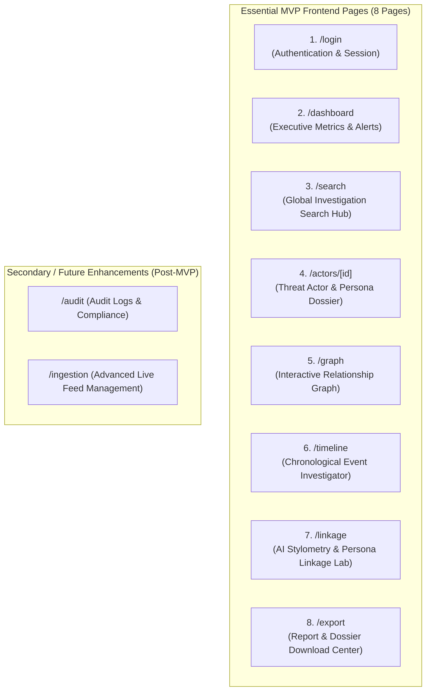
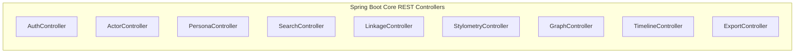
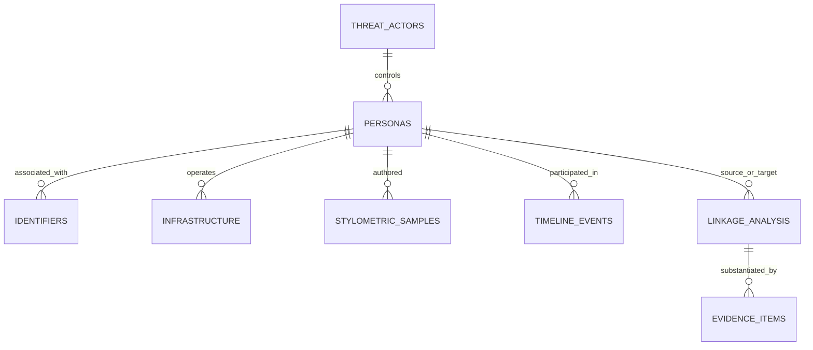
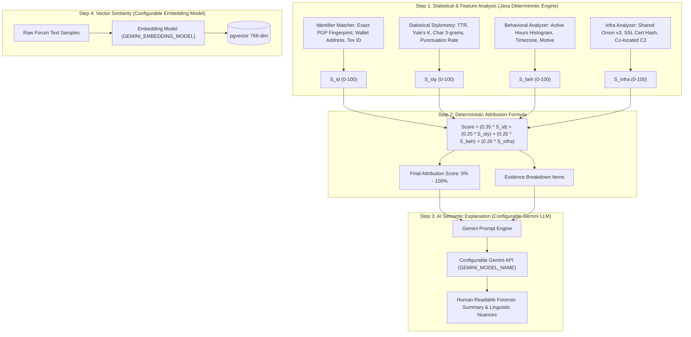
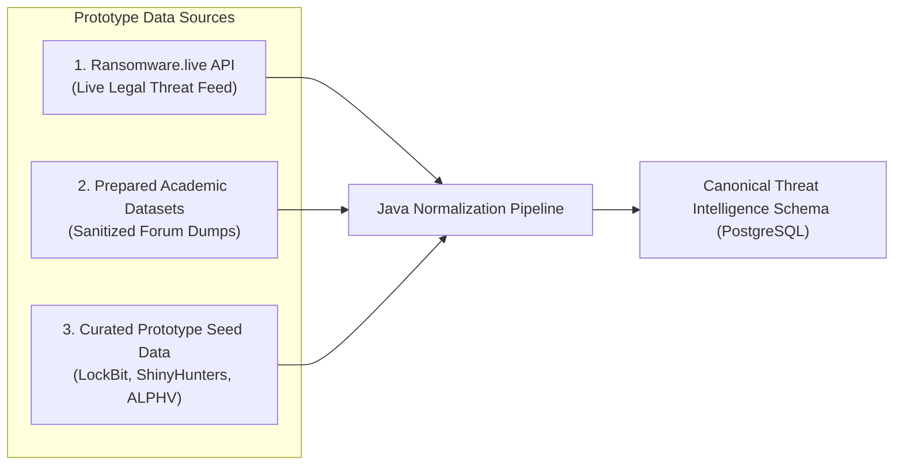
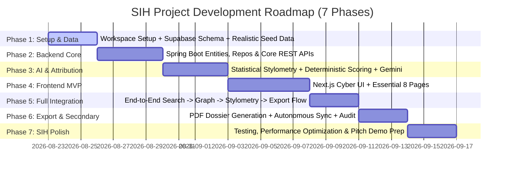

# Dark Web Deanonymizer — Project Architecture & Technical Blueprint
**Smart India Hackathon (SIH) Technical Specification & Implementation Blueprint**

---

## 1. Executive Summary, Ethical Boundaries & Hackathon MVP Definition

### 1.1 Objective & System Scope
The **Dark Web Deanonymizer** is an authorized cyber threat intelligence (CTI) and attribution platform designed for law enforcement agencies (LEAs), national CERTs, and security analysts. The platform ingests threat data from authorized feeds and prepared research archives, normalizes disparate intelligence, cross-correlates threat actor personas, performs statistical stylometric & behavioral profiling, calculates deterministic attribution confidence scores, and visualizes multi-hop relationship graphs and chronological timelines.

### 1.2 Ethical, Legal, and Prototype Boundaries
> [!IMPORTANT]
> **Ethical & Data Source Boundaries**:
> 1. **No Live/Illegal Scraping Dependency**: The prototype strictly avoids illegal dark-web probing, exploitation, or brute-force crawling. Instead, it is architected around **authorized public CTI feeds** (e.g., Ransomware.live API, AlienVault OTX, abuse.ch), **curated academic research datasets**, and **realistic sanitized threat intelligence dumps**.
> 2. **Probabilistic Attribution Principle**: AI and statistical outputs are **never** presented as absolute legal proof. Results are explicitly framed as **potential linkages** accompanied by transparent confidence scores (0%–100%) and verifiable evidence chains.

---

### 1.3 Hackathon MVP Core Demo Flow
For the Smart India Hackathon presentation, the platform is structured around a razor-sharp, end-to-end investigation scenario:

```mermaid
graph LR
    A["1. Search Persona / Actor"] --> B["2. View Related Intelligence"]
    B --> C["3. AI/ML Persona Comparison"]
    C --> D["4. Deterministic Attribution Score (0-100%)"]
    D --> E["5. Explainable Evidence Breakdown"]
    E --> F["6. Relationship Graph Visualization"]
    F --> G["7. Chronological Timeline"]
    G --> H["8. Export Investigation Report (PDF/JSON/CSV)"]
```



1. **Search**: Investigator inputs a handle (e.g., `"bassterlord"`, `"pompompurin"`), a crypto wallet, or a PGP fingerprint.
2. **Intelligence View**: System retrieves normalized forum profiles, associated identifiers, and infrastructure.
3. **Persona Comparison & Stylometry**: System computes statistical stylometry and requests Gemini semantic analysis between two suspected aliases.
4. **Attribution Confidence**: Deterministic 4-factor scoring engine calculates match percentage.
5. **Evidence Breakdown**: Interactive matrix explaining contributing factors (PGP match, shared wallet, vocabulary quirks, active hours).
6. **Relationship Graph**: Interactive node-link canvas showing connections between actor, personas, wallets, and hidden services.
7. **Timeline**: Chronological event stream tracking persona migrations and activities.
8. **Export**: One-click generation of court-ready PDF dossier, STIX 2.1 JSON, and CSV tables.

---

## 2. Overall System Architecture

```mermaid
graph TB
    subgraph "1. Ingestion Layer (Authorized Feeds & Research Dumps)"
        A1[Ransomware.live API Feed]
        A2[Open Threat Exchange OTX / Abuse.ch]
        A3[Prepared Academic Datasets & Sanitized Dumps]
        A4[Synthetic & Structured Seed Datasets]
    end

    subgraph "2. Backend Services Layer (Java Spring Boot 3.x)"
        B1[Ingestion & Normalization Service]
        B2[Actor & Persona Profiling Service]
        B3[Statistical Stylometry Engine (Java NLP)]
        B4[Behavioral & Timezone Analyzer]
        B5[Deterministic Attribution Scoring Engine]
        B6[Gemini Explanation & Semantic Bridge]
        B7[Graph & Timeline Transformation Service]
        B8[Export Service (PDF / JSON / CSV)]
        B9[Spring Security & JWT Auth Filter]
    end

    subgraph "3. AI & Embeddings (Configurable Services)"
        C1[Configurable Gemini LLM - Semantic Analysis & Explanations]
        C2[Configurable Embedding Model - Vector Similarity pgvector]
    end

    subgraph "4. Database & Storage Layer (Supabase PostgreSQL)"
        D1[(Core Relational Tables: Actors, Personas, Identifiers, Infra)]
        D2[(Intelligence Tables: Linkages, Evidence Items, Timeline Events)]
        D3[(Vector Embeddings - pgvector / tsvector Search)]
    end

    subgraph "5. Presentation Layer (Next.js 14 / React - MVP Scope)"
        E1["/login (Authentication)"]
        E2["/dashboard (Executive Overview & Metrics)"]
        E3["/search (Search & Investigation Hub)"]
        E4["/actors/[id] (Actor Dossier & Persona Profile)"]
        E5["/graph (Interactive Relationship Graph)"]
        E6["/timeline (Chronological Investigator)"]
        E7["/linkage (AI Persona Linkage & Evidence Matrix)"]
        E8["/export (Report & Export Center)"]
    end

    A1 & A2 & A3 & A4 --> B1
    B1 --> D1 & D2
    B2 <--> D1
    B3 & B4 --> B5
    B5 --> D2
    B5 --> B6
    B6 <--> C1
    B3 <--> C2 & D3
    B7 <--> D1 & D2
    B8 <--> D1 & D2
    E1 & E2 & E3 & E4 & E5 & E6 & E7 & E8 <-->|REST API / JWT| B9
    B9 <--> B2 & B5 & B6 & B7 & B8
```

---

## 3. Technology Stack & Configurable Components

| Layer | Technology | Configuration / Role in Prototype |
|---|---|---|
| **Frontend Framework** | **Next.js 14+ (App Router) / React 18+** | Fast, responsive UI with server/client components and clean routing. |
| **UI & Styling** | **Vanilla CSS + Glassmorphism Cyber Theme** | Dark cybersecurity theme (cyan/emerald/slate), responsive cards, micro-animations. |
| **Graph Visualizer** | **React Flow / Cytoscape.js** | Interactive force-directed node-link network (Actors, Personas, Wallets, Onion URLs). |
| **Timeline Visualizer** | **Vis-Timeline / Recharts** | High-density chronological timeline for multi-persona event tracking. |
| **Backend Framework** | **Java 17 / Spring Boot 3.3+** | Enterprise REST controllers, Spring Data JPA, validation, export utilities. |
| **Database** | **Supabase PostgreSQL 15+** | Relational data integrity, foreign key cascades, full-text indexes, `pgvector`. |
| **AI Explanation Engine** | **Google Gemini API (via AI Studio)** | **Configurable via `GEMINI_MODEL_NAME`** (e.g. `gemini-1.5-flash`, `gemini-2.0-flash`). Provides semantic reasoning, linguistic nuance detection, and human-readable forensic explanations. |
| **Embedding Engine** | **Configurable Embedding Model** | **Configurable via `GEMINI_EMBEDDING_MODEL`** (e.g. `text-embedding-004`). Generates text embeddings for vector similarity search. |
| **Attribution Engine** | **Deterministic Java Engine** | Mathematical 4-factor scoring formula. **Gemini does NOT assign the score.** |
| **Export Engines** | **OpenPDF / Flying Saucer & Apache Commons CSV** | Generates PDF intelligence dossiers, structured JSON, and CSV tables. |

---

## 4. Frontend Architecture: Streamlined MVP Scope

To maximize execution quality for the hackathon, the frontend is streamlined into **8 core essential pages**:



### 4.1 Detailed MVP Page Responsibilities

1. **`/login` — Authentication**:
   - Secure sign-in for authorized investigators with preset role credentials (e.g., Lead Analyst, Field Investigator).
2. **`/dashboard` — Executive Command Overview**:
   - High-impact summary cards: Total Tracked Actors, Monitored Personas, Extracted Wallets, Active Hidden Services, High-Confidence Attributions.
   - Threat category breakdown (Ransomware, Initial Access, Carding, Data Leaks) and recent high-priority attribution matches.
3. **`/search` — Investigation & Search Hub**:
   - Multi-faceted search bar: search by Handle, Actor Name, PGP Fingerprint, Crypto Wallet, Onion URL, or Keyword.
   - Live filter tags and instant card results leading directly to dossiers or graphs.
4. **`/actors/[id]` — Threat Actor & Persona Dossier**:
   - **Header**: Actor Alias, Threat Category, Status, Overall Confidence Gauge.
   - **Persona Sub-Profiles**: Discovered handles across forums (XSS, Exploit.in, Telegram, Dread).
   - **Digital Fingerprints**: PGP Key details, Cryptocurrency addresses (BTC/XMR) with balance/transaction summaries, Tox IDs.
   - **Infrastructure**: Onion v3 services, mirrors, C2 domains, and SSL certificate fingerprints.
5. **`/graph` — Interactive Relationship Graph**:
   - Force-directed interactive canvas connecting Actors (Hexagon), Personas (Circle), Wallets (Square), PGP Keys (Key), and Onion Services (Cloud).
   - Node click inspector, zoom/pan controls, and 1-hop / 2-hop neighbor expansion.
6. **`/timeline` — Chronological Event Investigator**:
   - Interactive zoomable timeline showing cross-forum posts, breach releases, wallet movements, and infrastructure updates over time.
7. **`/linkage` — AI Stylometry & Persona Linkage Lab**:
   - **Side-by-Side Text Comparison**: Compare samples from Persona A vs Persona B.
   - **Stylometric Metrics Card**: Lexical Richness (TTR, Yule's K), character n-gram similarity, and punctuation patterns.
   - **Attribution Score Card**: 0%–100% deterministic score with radial progress indicator.
   - **Evidence Matrix**: Detailed breakdown table showing each factor's weight and contribution.
   - **Gemini Forensic Synthesis**: AI-generated structured explanation of slang, dialect, OpSec mistakes, and rationale.
8. **`/export` — Dossier & Report Center**:
   - One-click export of an active investigation into a court-ready PDF briefing, STIX 2.1 JSON, or tabular CSV.

---

## 5. Backend Architecture & Core REST APIs

The backend is built with Java 17 and Spring Boot 3.3. Core MVP services are prioritized first:



### 5.1 MVP REST API Endpoints Specification

| Method | Endpoint | Description | Request / Query | Response Payload |
|---|---|---|---|---|
| `POST` | `/api/v1/auth/login` | Authenticate investigator | `{ username, password }` | `{ token, user: { name, role } }` |
| `GET` | `/api/v1/dashboard/stats` | Summary statistics for dashboard | None | Total counts, category breakdowns, recent alerts |
| `GET` | `/api/v1/search` | Global multi-faceted search | `?q=...&type=ALL|HANDLE|WALLET|PGP` | Unified search results list |
| `GET` | `/api/v1/actors` | List threat actors with pagination | `?page=0&size=10&category=...` | Paginated list of threat actor summaries |
| `GET` | `/api/v1/actors/{id}` | Complete threat actor dossier | Path variable `id` | Full actor object with nested personas, identifiers, and infra |
| `GET` | `/api/v1/personas/{id}` | Persona details & text samples | Path variable `id` | Persona profile, text samples, and linked identifiers |
| `POST` | `/api/v1/stylometry/compare` | Compare 2 text samples / personas | `{ personaAId, personaBId }` or raw texts | Statistical metrics (TTR, n-grams) + Gemini explanation |
| `GET` | `/api/v1/linkages` | List calculated persona linkages | `?minScore=50` | List of linkage analysis candidates with scores |
| `POST` | `/api/v1/linkages/compute` | Run deterministic attribution calculation | `{ sourcePersonaId, targetPersonaId }` | Linkage record with score, breakdown, and Gemini explanation |
| `GET` | `/api/v1/graph/actor/{id}` | Sub-graph for a specific actor | Path variable `id`, `?depth=2` | Nodes and Edges JSON for React Flow |
| `GET` | `/api/v1/graph/global` | Global network graph | `?limit=100` | Top connected nodes and edges |
| `GET` | `/api/v1/timeline/actor/{id}` | Chronological events for an actor | Path variable `id` | Sorted array of timeline event objects |
| `GET` | `/api/v1/export/pdf/{actorId}` | Generate & download PDF dossier | Path variable `id` | Binary PDF stream (`application/pdf`) |
| `GET` | `/api/v1/export/json/{actorId}` | Export structured intelligence | Path variable `id` | STIX 2.1 compatible JSON payload |
| `GET` | `/api/v1/export/csv/{actorId}` | Export forensic indicators table | Path variable `id` | CSV file download |

---

## 6. Database Schema Design (Supabase PostgreSQL)

Core MVP tables are prioritized for data integrity and high-performance querying.



### 6.1 Core MVP Tables

1. **`threat_actors`**:
   - `id` (UUID, PK, `gen_random_uuid()`)
   - `canonical_name` (VARCHAR(100), UNIQUE) — e.g. "LockBit Operations", "ShinyHunters Group"
   - `threat_category` (VARCHAR(50)) — "RANSOMWARE", "INITIAL_ACCESS", "DATA_BROKER", "CARDING"
   - `primary_motive` (VARCHAR(50)) — "FINANCIAL", "ESPIONAGE", "HACKTIVISM"
   - `status` (VARCHAR(30)) — "ACTIVE", "DORMANT", "ARRESTED"
   - `overall_confidence_score` (DECIMAL(5,2))
   - `summary` (TEXT)
   - `first_observed_at`, `last_observed_at` (TIMESTAMP)

2. **`personas`**:
   - `id` (UUID, PK)
   - `actor_id` (UUID, FK -> `threat_actors.id`, NULLABLE)
   - `handle` (VARCHAR(100)) — e.g. "bassterlord", "pompompurin", "alphv_admin"
   - `platform` (VARCHAR(100)) — e.g. "XSS.is", "Exploit.in", "Breached", "Telegram", "Dread"
   - `reputation_score` (DECIMAL(5,2))
   - `status` (VARCHAR(30)) — "ACTIVE", "BANNED", "MIGRATED"
   - `activity_timezone_estimated` (VARCHAR(50)) — e.g. "UTC+3 (MSK)", "UTC+8"
   - `first_seen_at`, `last_seen_at` (TIMESTAMP)

3. **`identifiers`**:
   - `id` (UUID, PK)
   - `persona_id` (UUID, FK -> `personas.id`)
   - `type` (VARCHAR(50)) — "PGP_FINGERPRINT", "BTC_WALLET", "XMR_WALLET", "ETH_WALLET", "EMAIL", "TOX_ID", "TELEGRAM_HANDLE"
   - `value` (TEXT) — e.g. `bc1q9...`, PGP Fingerprint `4A72 B5C1...`
   - `metadata` (JSONB) — `{ "tx_count": 42, "total_received_btc": 14.5, "pgp_key_id": "0x4A72B5C1" }`
   - `is_verified` (BOOLEAN)

4. **`infrastructure`**:
   - `id` (UUID, PK)
   - `persona_id` (UUID, FK -> `personas.id`, NULLABLE)
   - `type` (VARCHAR(50)) — "ONION_V3", "CLEARSIGNAL_MIRROR", "C2_SERVER", "TELEGRAM_CHANNEL"
   - `value` (VARCHAR(500)) — e.g. `http://lockbit7...onion`
   - `ip_address` (VARCHAR(45))
   - `asn` (VARCHAR(100))
   - `is_live` (BOOLEAN)
   - `last_scanned_at` (TIMESTAMP)

5. **`stylometric_samples`**:
   - `id` (UUID, PK)
   - `persona_id` (UUID, FK -> `personas.id`)
   - `sample_title` (VARCHAR(200)) — e.g. "Exploit.in Forum Post #12", "Ransom Note v3"
   - `raw_text` (TEXT)
   - `clean_text` (TEXT)
   - `token_count` (INT)
   - `lexical_metrics` (JSONB) — `{ "ttr": 0.68, "yules_k": 42.1, "avg_sentence_len": 18.2, "punctuation_rate": 0.08 }`
   - `embedding` (vector(768), NULLABLE) — Vector embedding for semantic similarity search
   - `collected_at` (TIMESTAMP)

6. **`linkage_analysis`**:
   - `id` (UUID, PK)
   - `source_persona_id` (UUID, FK -> `personas.id`)
   - `target_persona_id` (UUID, FK -> `personas.id`)
   - `attribution_score` (DECIMAL(5,2)) — **Deterministic 0.00% to 100.00%**
   - `confidence_level` (VARCHAR(20)) — "HIGH" (>=85%), "MODERATE" (65-84%), "LOW" (40-64%), "INSUFFICIENT" (<40%)
   - `identifier_score` (DECIMAL(5,2)) — 0–100 sub-score
   - `stylometric_score` (DECIMAL(5,2)) — 0–100 sub-score
   - `behavioral_score` (DECIMAL(5,2)) — 0–100 sub-score
   - `infrastructure_score` (DECIMAL(5,2)) — 0–100 sub-score
   - `ai_explanation_summary` (TEXT) — **Generated by Google Gemini**
   - `computed_at` (TIMESTAMP)

7. **`evidence_items`**:
   - `id` (UUID, PK)
   - `linkage_id` (UUID, FK -> `linkage_analysis.id`)
   - `factor_category` (VARCHAR(50)) — "IDENTIFIER", "STYLOMETRY", "BEHAVIOR", "INFRASTRUCTURE"
   - `title` (VARCHAR(255)) — e.g. "Matching PGP Subkey ID 0x4A72B5C1"
   - `contribution_points` (DECIMAL(5,2)) — Points added to attribution score
   - `details` (TEXT) — Contextual explanation
   - `evidence_snippet` (TEXT)

8. **`timeline_events`**:
   - `id` (UUID, PK)
   - `persona_id` (UUID, FK -> `personas.id`)
   - `event_type` (VARCHAR(50)) — "FORUM_POST", "BREACH_ANNOUNCED", "WALLET_PAYMENT", "INFRA_ONLINE"
   - `title` (VARCHAR(255))
   - `description` (TEXT)
   - `event_timestamp` (TIMESTAMP)
   - `severity` (VARCHAR(20)) — "INFO", "MEDIUM", "HIGH", "CRITICAL"

### 6.2 Secondary Tables (Post-MVP Enhancements)
- `data_sources` & `ingestion_logs` (for automated feed sync tracking)
- `audit_logs` (for analyst query auditing & compliance)

---

## 7. AI/ML Attribution & Explainability Architecture



### 7.1 Separation of Concerns: Math vs. AI Explanation
> [!IMPORTANT]
> **Core Principle**: Google Gemini **does not** generate or decide the numerical attribution score. 
> 1. The **Attribution Score (0%–100%)** is calculated **100% deterministically** by the Java backend using the weighted formula below.
> 2. **Google Gemini** is used to synthesize the findings, explain linguistic patterns, identify slang/regional idioms, detect OpSec mistakes, and produce a human-readable forensic summary.

### 7.2 Deterministic Attribution Formula
$$S_{\text{total}} = (0.35 \cdot S_{\text{id}}) + (0.25 \cdot S_{\text{sty}}) + (0.20 \cdot S_{\text{beh}}) + (0.20 \cdot S_{\text{infra}})$$

1. **Identifier Overlap ($S_{\text{id}}$, Weight: 35%)**:
   - Exact PGP Master Key or Subkey match: **100 pts**
   - Exact Shared Crypto Wallet (Deposit/Withdrawal): **90 pts**
   - Matching Contact Identifier (Tox ID, custom email): **75 pts**
2. **Stylometric Similarity ($S_{\text{sty}}$, Weight: 25%)**:
   - Character 3-gram Cosine Similarity: **40% contribution**
   - Lexical Richness (Type-Token Ratio & Yule's K alignment): **30% contribution**
   - Punctuation & Casing distribution correlation: **30% contribution**
3. **Behavioral & Temporal Overlap ($S_{\text{beh}}$, Weight: 20%)**:
   - Hourly activity histogram correlation (estimated active timezone): **60% contribution**
   - Target sector / threat motive alignment: **40% contribution**
4. **Infrastructure Proximity ($S_{\text{infra}}$, Weight: 20%)**:
   - Shared Onion v3 service / mirror or linked SSL certificate hash: **80 pts**
   - Co-located IP / C2 Subnet / ASN: **50 pts**

### 7.3 Configurable Gemini AI Environment Variables
The Gemini integration avoids hard-coded model identifiers and uses environment variables:

```bash
# Generative LLM for forensic explanations and linguistic synthesis
GEMINI_API_KEY=your_google_ai_studio_api_key
GEMINI_MODEL_NAME=gemini-1.5-flash        # e.g., gemini-1.5-flash, gemini-2.0-flash, gemini-1.5-pro

# Separate model for vector embedding generation
GEMINI_EMBEDDING_MODEL=text-embedding-004 # e.g., text-embedding-004
```

---

## 8. Data Ingestion for Hackathon Prototype

To ensure 100% legal compliance and zero runtime failure during the hackathon demonstration, the prototype ingests from three reliable sources:



1. **Live Legal Feed (Ransomware.live API)**: Ingests real-time ransomware victim posts, group names, and public leak portal URLs.
2. **Prepared Academic Datasets**: Pre-sanitized, anonymized forum post text samples for stylometric comparison.
3. **Curated Prototype Seed Dataset**: Highly realistic seed profiles representing notorious threat groups (e.g., *LockBit / Bassterlord*, *ShinyHunters*, *ALPHV / BlackCat*, *Lapsus$*) populated with realistic PGP keys, Bitcoin/Monero addresses, and multi-forum personas.

---

## 9. Recommended Project Folder Structure

```
dark-web-deanonymizer/
├── frontend/                          # Next.js 14 / React Frontend
│   ├── public/                        # Static assets, cybersecurity icons
│   ├── src/
│   │   ├── app/                       # 8 Essential MVP Pages
│   │   │   ├── (auth)/login/          # 1. Login Page
│   │   │   ├── dashboard/             # 2. Executive Dashboard
│   │   │   ├── search/                # 3. Investigation & Search Hub
│   │   │   ├── actors/[id]/           # 4. Threat Actor / Persona Dossier
│   │   │   ├── graph/                 # 5. Interactive Relationship Graph
│   │   │   ├── timeline/              # 6. Chronological Investigator
│   │   │   ├── linkage/               # 7. AI Stylometry & Linkage Lab
│   │   │   └── export/                # 8. Report & Export Center
│   │   ├── components/                # Reusable UI Components
│   │   │   ├── common/                # Glassmorphic cards, badges, inputs
│   │   │   ├── graph/                 # React Flow / Cytoscape canvas
│   │   │   ├── timeline/              # Time-series chart & event cards
│   │   │   ├── stylometry/            # Diff viewer, radar charts, evidence matrix
│   │   │   └── layout/                # CyberNavbar, Sidebar, StatusPill
│   │   ├── lib/                       # API client, types, formatters
│   │   └── styles/                    # Global CSS & Cyber Theme variables
│   ├── package.json
│   └── next.config.js
│
├── backend/                           # Java Spring Boot 3.x Application
│   ├── src/
│   │   ├── main/
│   │   │   ├── java/com/sih/deanonymizer/
│   │   │   │   ├── config/            # SecurityConfig, CorsConfig, GeminiConfig
│   │   │   │   ├── controller/        # REST Controllers (Actor, Search, Graph, etc.)
│   │   │   │   ├── service/           # Core Business Logic
│   │   │   │   │   ├── ai/            # GeminiExplanationService, EmbeddingService
│   │   │   │   │   ├── stylometry/    # Java Statistical NLP & N-Gram Analyzers
│   │   │   │   │   ├── scoring/       # Deterministic Attribution Scoring Engine
│   │   │   │   │   ├── graph/         # Node/Edge Graph Builder
│   │   │   │   │   ├── export/        # PDF Dossier Generator & CSV Exporter
│   │   │   │   │   └── ingestion/     # FeedConnectors & Normalization
│   │   │   │   ├── repository/        # Spring Data JPA Repositories
│   │   │   │   └── model/             # JPA Entities and DTOs
│   │   │   └── resources/
│   │   │       ├── application.yml    # App config with ENV variable mappings
│   │   │       └── schema.sql         # Database DDL initialization
│   │   └── test/                      # Unit & Scoring formula tests
│   └── pom.xml
│
├── database/                          # Supabase PostgreSQL Scripts
│   ├── schema.sql                     # Table schemas, indexes, foreign keys
│   └── seed_data.sql                  # Comprehensive realistic prototype seed data
│
├── docs/                              # Architecture Diagrams & Presentation
└── PROJECT_BLUEPRINT.md               # Master Blueprint & Plan (This Document)
```

---

## 10. Prioritized 7-Phase Development Roadmap



### Phase Details

- **Phase 1: Project Setup + Supabase + Seed Data**:
  - Initialize project repository structure.
  - Setup Supabase PostgreSQL tables (`threat_actors`, `personas`, `identifiers`, `infrastructure`, `stylometric_samples`, `linkage_analysis`, `evidence_items`, `timeline_events`).
  - Populate comprehensive, realistic seed data for prototype threat actors (*LockBit / Bassterlord*, *ShinyHunters*, *ALPHV*, *Lapsus$*).

- **Phase 2: Spring Boot Backend + Core APIs**:
  - Setup Java 17 + Spring Boot 3.3 project with Spring Data JPA and Web.
  - Implement JPA entities, DTOs, and repositories.
  - Build REST controllers for Actors, Personas, Global Search, Graph, and Timeline.

- **Phase 3: Stylometry + Behavioral Analysis + Attribution Scoring + Gemini Explanation**:
  - Implement Java statistical NLP algorithms (Type-Token Ratio, Yule's K, Character 3-grams, Punctuation frequency).
  - Implement deterministic 4-factor attribution scoring formula and evidence breakdown builder.
  - Build configurable Google Gemini API client (`GEMINI_MODEL_NAME`) for forensic semantic explanation generation.
  - Setup configurable embedding service (`GEMINI_EMBEDDING_MODEL`) for vector similarity search.

- **Phase 4: Frontend Development (Essential 8 Pages)**:
  - Build Next.js 14 frontend with cyber glassmorphic dark theme.
  - Implement the 8 core pages: Login, Dashboard, Search, Actor Dossier, Relationship Graph (React Flow/Cytoscape), Timeline, AI Linkage Lab, and Export Center.

- **Phase 5: Full Integration**:
  - Connect Next.js frontend to Spring Boot backend APIs.
  - Validate the complete core demo flow:
    *Search Persona → View Intelligence → Compare Stylometry → Deterministic Score & Evidence Breakdown → Graph & Timeline → Export.*

- **Phase 6: Export + Autonomous Ingestion + Secondary Features**:
  - Implement PDF Intelligence Dossier generator with embedded graph and timeline snapshots.
  - Implement STIX 2.1 JSON and CSV export endpoints.
  - Add background feed polling (Ransomware.live connector) and secondary audit logging.

- **Phase 7: Testing + SIH Demo Polish**:
  - Run end-to-end integration tests and response time optimizations.
  - Polish UI animations, tooltips, and responsive layout.
  - Prepare flawless hackathon demonstration script and sample investigation walkthrough.

---

## 11. Summary of Blueprint Revisions

| Requirement | Implementation in Revised Blueprint |
|---|---|
| **Hackathon MVP Flow** | Explicitly defined 8-step demo path (*Search → Intel → Stylometry → Attribution Score → Evidence Matrix → Graph → Timeline → Export*). |
| **Streamlined Frontend** | Reduced initial scope to **8 essential pages**; secondary pages (Audit, Advanced Ingestion) deferred to Phase 6. |
| **Prototype Data Sources** | Built on authorized feeds (Ransomware.live API), academic research datasets, and realistic seed data (no illegal scraping). |
| **Deterministic Scoring** | Kept exact 4-factor formula: Identifiers (35%), Stylometry (25%), Behavior (20%), Infrastructure (20%). |
| **Role of Gemini AI** | Gemini **does not** generate the score; Java computes the deterministic score, while Gemini provides semantic forensic explanations. |
| **Configurable AI Models** | Configurable via `GEMINI_MODEL_NAME` (e.g. `gemini-1.5-flash`, `gemini-2.0-flash`) and separate `GEMINI_EMBEDDING_MODEL` (e.g. `text-embedding-004`). |
| **Core Database & APIs** | Prioritized core MVP entities and REST controllers before secondary RBAC/audit logs. |
| **7-Phase Roadmap** | Sequenced: Setup/DB → Backend APIs → Stylometry & Gemini → Frontend → Integration → Export/Sync → SIH Polish. |

---

*No application code has been written yet. Please review this revised blueprint and provide your approval to begin **Phase 1: Project Setup & Database Layer**.*
